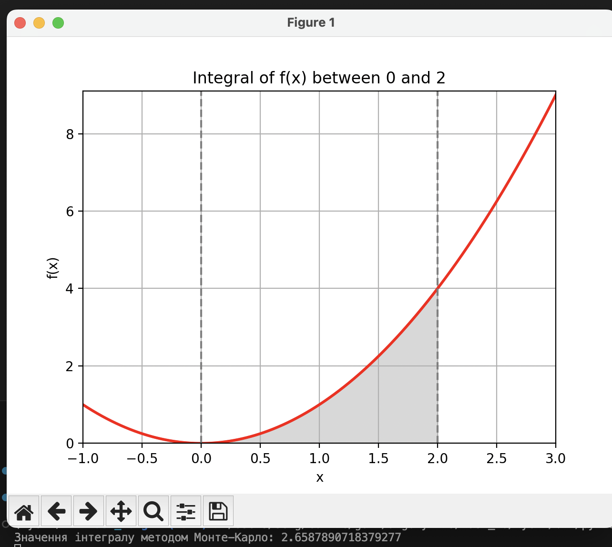

## Висновки

1. Метод Монте-Карло - це метод імітації для приблизного відтворення реальних явищ.
2. Цей метод дає змогу побудувати модель, мінімізуючи дані, а також максимізувати значення даних, які використовуються в моделі.
3. Метод Монте-Карло особливо корисен для моделювання явищ зі значною невизначеністю вхідних даних і систем з великим числом пов'язаних ступенів вільності.
4. Результат розрахунків (2.6587890718379277) близький до точного значення методу (2.6666666666667).

Графічний результат
